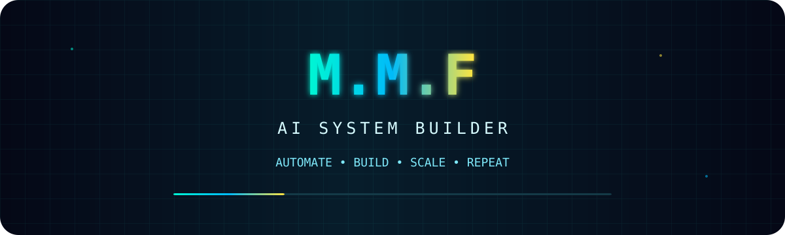
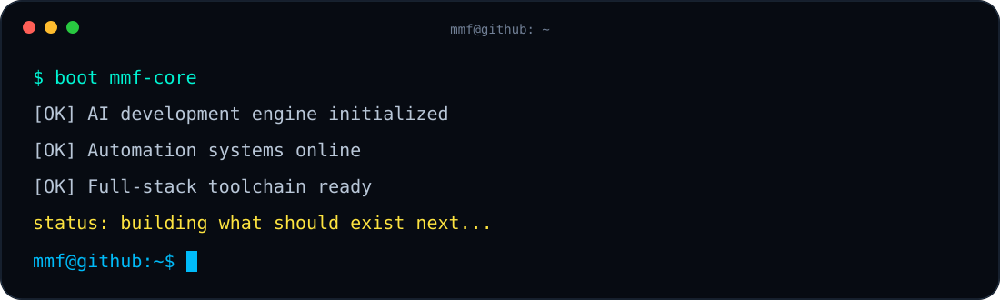

<div align="center">



<br/>


<br/>


&nbsp;

&nbsp;


</div>

<br/>

## `> whoami`

```text
M.M.F // AI SYSTEM BUILDER

Focus      : AI-powered software engineering
Mindset    : Build → Automate → Test → Improve → Repeat
Environment: Linux / Cloud / Mobile / Web
Status     : Turning ideas into real systems
```

<div align="center">
  
</div>

<br/>

## ⚡ `SYSTEM STACK`

<div align="center">


<br/>


</div>

<br/>

<div align="center">

`AI AGENTS` • `AUTOMATION` • `FULL STACK` • `REALTIME` • `APIs` • `MOBILE` • `CLOUD` • `LINUX`

</div>

---

## 🕹️ `CONTRIBUTION ARCADE`

<div align="center">

<picture>
  <source media="(prefers-color-scheme: dark)" srcset="https://raw.githubusercontent.com/haiderabode31334/M.M.F/output/pacman-contribution-graph-dark.svg">
  <source media="(prefers-color-scheme: light)" srcset="https://raw.githubusercontent.com/haiderabode31334/M.M.F/output/pacman-contribution-graph.svg">
  
</picture>

<br/>

<picture>
  <source media="(prefers-color-scheme: dark)" srcset="https://raw.githubusercontent.com/haiderabode31334/M.M.F/output/github-snake-dark.svg">
  <source media="(prefers-color-scheme: light)" srcset="https://raw.githubusercontent.com/haiderabode31334/M.M.F/output/github-snake.svg">
  
</picture>

</div>

> The arcade graphics are generated automatically from GitHub contribution activity and refreshed by GitHub Actions.

---

## 🌃 `3D CONTRIBUTION SKYLINE`

<div align="center">

<picture>
  <source media="(prefers-color-scheme: dark)" srcset="./profile-3d-contrib/profile-night-rainbow.svg">
  <source media="(prefers-color-scheme: light)" srcset="./profile-3d-contrib/profile-season-animate.svg">
  
</picture>

</div>

---

## 📡 `DEVELOPER SIGNAL`

<div align="center">


<br/>


</div>

---

<div align="center">

### `M.M.F // BUILDING THE NEXT SYSTEM`


</div>
